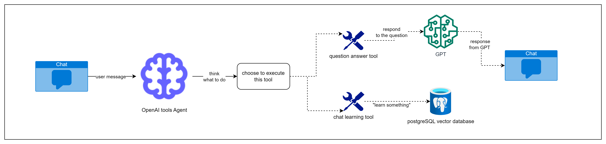
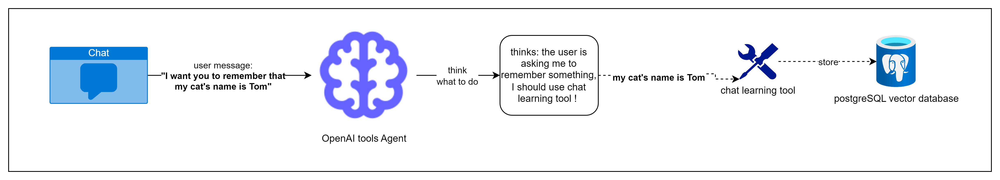
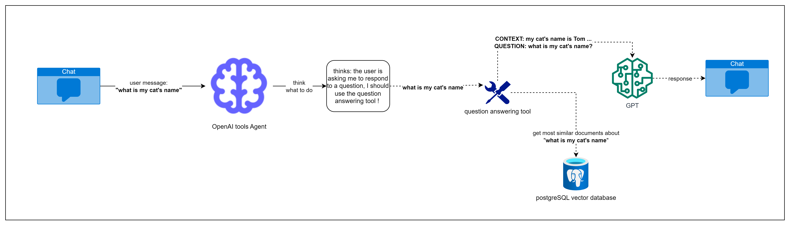

# Overview
Welcome to the Langchain Agent RAG example repository! 
This tool merges the functionalities of RAG technique and Large Language Models (LLMs) 
to craft an interactive search experience. The example utilizes an Azure OpenAI GPT model and a PostgreSQL vector store
(PGVector) to implement the Retrieval-Augmented-Generation, seamlessly integrating them into a web application. 
Users can manually upload files that will represent the augmented knowledge of the LLM model.

This example comes from an analysis and improvement of the official example from Azure:
https://github.com/Azure-Samples/chat-with-your-data-solution-accelerator
### differences & improvements with the original version
* this example makes use of openai tools agent type, which is more accurate and powerful
* I've added a feature of "learning directly from chat": the user can require to learn something to the assistant;
In this case the openai agent extract the relevant information to learn and feeds tge RAG storage 

## How it works

> 1. The user sends a message to the assistant
> 2. the assistant invokes langchain openai tools agent
>    1. an agent is an object that is able to analyze an input request and decide what to do. The agent's decision is based on the tools that has at its disposal
>    2. we have previously declared 2 tools: question answering tool and chat learning tool
> 3. the agent decide to execute one tool over another
> 4. the tool executes
>    1. if agent decides to execute the question answering tool **then** an LLMChain is invoked (retrieve most relevant document from the RAG storage and pass it to the LLM alongside the user question)
>    2. if agent decides to execute the chat learning tool **then** will be extracted the most relevant information from the user question and it will be stored inside the RAG storage (it can then be used by the question answering tool to generate any response)
> 5. a response is sent to the user

## Set up front-end
> 1. cd /path/to/project/code/app/frontend
> 2. npm install
> 3. npm run dev -> exposes react to localhost:5173

## Set up back-end
> 1. cd /path/to/project/code/app
> 2. pip install -r requirements.txt
> 3. python app.py -> exposes back-end rest api server to localhost:5000

## Set up vector store
> 1. cd /path/to/project/docker  
> 2. docker-compose -f docker-compose-postgres.yml up -d

## Execution case Chat Learning Tool

## Execution case Question Answering Tool

## Feed the vector store (RAG Storage) with PDF files
There is an example folder (/data) which contains a bunch of pdf files you can use to try
the pdf files RAG ingestion.
One way to do it is by using the python script:
> python **load_pdf_document.py** /path/to/project/data/Benefit_Options.pdf

If you want to load your own pdf file you can run:
> python **load_pdf_document.py** /path/to/your/pdf/file.pdf

## How does an Agent knows which tool execute?
Each tool has a description of what it does, the functionality that provides
or the condition that must occur to execute it.
For example the chat learning tool's description is:
> """This tool useful when the user asks you to remember or learn something.
    Action Input should be only the relevant information to remember/learn.
    Run the tool when the user asks you to learn or remember something, get only the text that represents the informations to learn or remember;
    For example: 1. if you receive the request "I want you to learn that [...]" run the tool and get only the [...] text
    or 2. if you receive the request "learn the following: [...]", run the tool and get only the [...] text"""

Thus when an agent receives a sentence from the user that says: **"I want you to learn that my cat's name is Tom"**, it
1. reads all the tool's description that the agent has access for
2. in this case, based on the above tool's description, it selects the chat learning tool because the user is asking to remember something (as the tool's description says)

NOTE: an Agent interacts with an LLM too to decide which tool to use